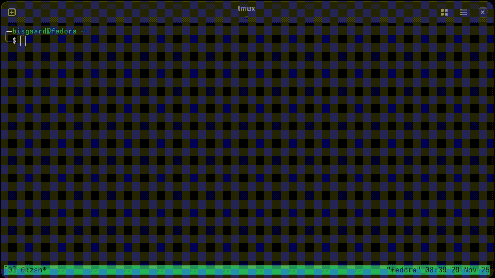

# Bayesh
**Make more of your shell history!**



## What is Bayesh?  
Bayesh is the auto-suggestion feature on your phone when you write messages — but for your terminal! Bayesh suggests shell commands to you in real time, based on your shell history. Bayesh is lightening fast ⚡ (written in Go) and powered by [fzf](https://github.com/junegunn/fzf) for great UX. Bayesh supports Bash and Zsh shells. Zsh in [tmux](https://github.com/tmux/tmux) is where Bayesh really shines ☀️.

## Installation 

1. **Install Dependencies:**  
   Ensure you have the following installed:  
   - [fzf](https://github.com/junegunn/fzf)  
   - [jq](https://jqlang.org/)  
   - [tmux](https://github.com/tmux/tmux) (optional, but highly recommmended)
   
2. **Install Bayesh:**  
   To install Bayesh into your Zsh shell, run  
   ```bash
   curl -sL https://raw.githubusercontent.com/mads-bisgaard/bayesh/refs/heads/main/install.sh | zsh -s zsh
   ```
   if instead you want to install it into your Bash shell, run
   ```bash
   curl -sL https://raw.githubusercontent.com/mads-bisgaard/bayesh/refs/heads/main/install.sh | bash -s bash
   ```

## How to Use Bayesh 
Bayesh is triggered by hitting `Ctrl-e` in your shell.  

When using Zsh shell in tmux you
- toggle the fzf pane with `Ctrl-<up arrow>` and `Ctrl-<down arrow>`.  
- select a suggestion with `Ctrl-<right arrow>`.  

At first Bayesh has a short "learning phase" before it will start suggesting you commands.

## Gotchas 
Bayesh relies on your shell’s history behavior. To get the best experience:  

- **For Bash Users:**  
  Add this to your `~/.bashrc`:  
  ```bash
  export HISTCONTROL=
  ```  

- **For Zsh Users:**  
  Add this to your `~/.zshrc`:  
  ```bash
  unsetopt HIST_IGNORE_DUPS
  ```  

Test your setup by running `history -1` twice. If the two lines are different (timestamps or event numbers), you’re good to go!  

---

## Inspirations 
Bayesh draws inspiration from:  
- [autojump](https://github.com/wting/autojump), [z](https://github.com/rupa/z), and [zoxide](https://github.com/ajeetdsouza/zoxide)  
- The incredible [fzf](https://github.com/junegunn/fzf)  
- [Peter Norvig](https://norvig.com/)'s legendary [blogpost](https://norvig.com/spell-correct.html) on building a spelling corrector  

---

## Contributions 

Want to contribute? Whether it's fixing a bug, suggesting a feature, or improving documentation, your help is very much appreciated.  

### How to Contribute:  
1. Fork the repository.  
2. Create a new branch for your changes.  
3. Submit a pull request with a clear description of your changes.  

Feel free to open an issue if you have questions or need guidance. Let's make Bayesh even better together!  


## Why the Name "Bayesh"? 👀  
**Bayes**ian statistics applied to your Z**sh** history.
