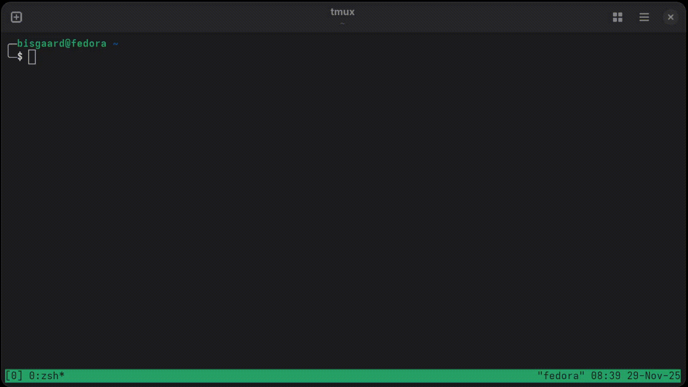

# Bayesh
**Make better use of your shell history!**



## What is Bayesh?  
Bayesh is an auto-suggestion feature for your Zsh shell. Bayesh keeps track of your shell history and based on the current context, suggests shell commands to you in real time. Bayesh is an attempt to apply the core idea of [z](https://github.com/rupa/z), not only to the `cd` command, but to your full shell history.

The plan is for Bayesh to integrate many "autosuggestion/autocompletion" tools in the near future.

Bayesh is lightening fast ⚡ (written in Go) and powered by [fzf](https://github.com/junegunn/fzf) for great UX. 

## Installation 

1. **Install Dependencies:**  
  Ensure you have the following installed: [fzf](https://github.com/junegunn/fzf?tab=readme-ov-file#installation), [jq](https://jqlang.org/download/), [tmux](https://github.com/tmux/tmux/wiki/Installing#installing-tmux)
  
2. **Install Bayesh:**  
  To install Bayesh run  
  ```sh
  curl -sSLf https://raw.githubusercontent.com/mads-bisgaard/bayesh/refs/heads/main/install.sh | sh
  ```
  
Make sure to [integrate](#shell-integration) Bayesh into your shell.

## Shell integration
  - To integrate Bayesh into Zsh, add `source <(bayesh --zsh)` to your configuration file. You can do so by executing the following command in your shell:
  ```sh
  echo "command -v bayesh > /dev/null && source <(bayesh --zsh)" >> ~/.zshrc
  ```

## How to Use Bayesh 
Once inside a [tmux](https://github.com/tmux/tmux/wiki/Installing#installing-tmux) session (achieved by running `tmux` in your zsh shell), you open/close Bayesh by hitting `Ctrl-e` in your shell. Once open, 
- toggle the fzf pane with `Ctrl-<up arrow>` and `Ctrl-<down arrow>`.  
- select a suggestion with `Ctrl-<right arrow>`.  

At first Bayesh has a short "learning phase" before it will start suggesting you commands.


## Inspirations 
Bayesh draws inspiration from:  
- [autojump](https://github.com/wting/autojump), [z](https://github.com/rupa/z), and [zoxide](https://github.com/ajeetdsouza/zoxide)  
- The incredible [fzf](https://github.com/junegunn/fzf)  
- [Peter Norvig](https://norvig.com/)'s legendary [blogpost](https://norvig.com/spell-correct.html) on building a spelling corrector  


## Contributions 

Want to contribute? Whether it's fixing a bug, suggesting a feature, or improving documentation, your help is very much appreciated.  

### How to Contribute:  
1. Fork the repository.  
2. Create a new branch for your changes.  
3. Submit a pull request with a clear description of your changes.  

Feel free to open an issue if you have questions or need guidance. Let's make Bayesh even better together!  


## Why the Name "Bayesh"? 👀  
**Bayes**ian statistics applied to your Z**sh** history.


## Gotchas 
- Bayesh relies on your shell’s history behavior. To get the best experience:  

  - **For Bash Users:**  
    Add this to your `~/.bashrc`:  
    ```bash
    export HISTCONTROL=
    ```  

  - **For Zsh Users:**  
    Add this to your `~/.zshrc`:  
    ```bash
    unsetopt HIST_IGNORE_DUPS
    ```  

  Test your setup by running `history -1` twice. If the two lines are different (timestamps or event numbers), you’re good to go!  

-  Bayesh is built with `CGO_ENABLED=1`, so it relies on glibc being available at run time. 