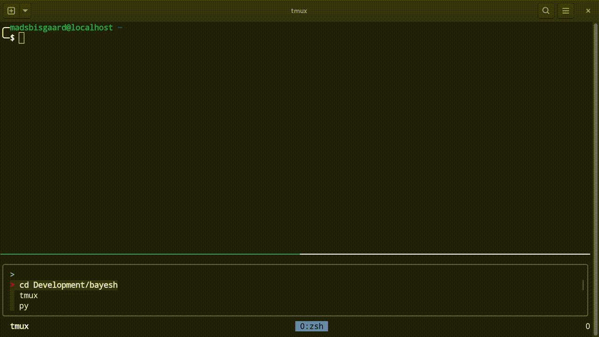

# Bayesh 🚀  
**Your shell history, smarter and faster.**



## What is Bayesh?  
Bayesh is your personal shell assistant, designed to make your command-line experience smoother and more efficient. It learns from your shell history and suggests commands you’ve used before. Powered by [fzf](https://github.com/junegunn/fzf), Bayesh brings a sleek and intuitive UI to your terminal.

### Why Bayesh? 🤔  
- **Save Time:** Stop retyping or searching for commands you’ve already used.  
- **Stay Focused:** Let Bayesh handle the repetitive stuff while you focus on what matters.  
- **Privacy First:** Bayesh only learns from *your* history—no external data, no surprises. Your data stays with you and is never uploaded anywhere.  
- **Zsh First, Bash Friendly:** While optimized for Z-shell (zsh), Bayesh works great with bash too.  

---

## Installation 🛠️  

1. **Install Dependencies:**  
   Ensure you have the following installed:  
   - [fzf](https://github.com/junegunn/fzf)  
   - [jq](https://jqlang.org/)  
   - [python3](https://www.python.org/)
   - [tmux](https://github.com/tmux/tmux) (optional, but highly recommmended)

2. **Install Bayesh:**  
   Run this snippet in your shell:  
   ```bash
   git clone https://github.com/mads-bisgaard/bayesh.git ~/.bayesh/bayesh
   ~/.bayesh/bayesh/install.sh "$(basename "$SHELL")"
   ```

---

## How to Use Bayesh 🎯 
Bayesh is triggered by hitting `Ctrl-e` in your shell.  

### Pro Tip for Z-shell Users:  
If you’re using [tmux](https://github.com/tmux/tmux), you’ll love this:  
- Toggle the fzf pane with `Ctrl-<up arrow>` and `Ctrl-<down arrow>`.  
- Select a suggestion with `Ctrl-<right arrow>`.  

---

## Why You'll Love Bayesh ❤️  
Think of Bayesh as the auto-suggestion feature on your smartphone—but for your terminal. It’s like having a personal assistant that remembers everything you’ve done and helps you do it faster.  

### Key Features:  
- **No Guesswork:** Bayesh only suggests commands you’ve actually used.  
- **Quick Learning:** It starts being useful after just a short learning phase.  
- **Customizable:** Works seamlessly with your shell setup.  

---

## Gotchas ⚠️  
Bayesh relies on your shell’s history behavior. To get the best experience:  

- **For Bash Users:**  
  Add this to your `~/.bashrc`:  
  ```bash
  export HISTCONTROL=
  ```  

- **For Zsh Users:**  
  Add this to your `~/.zshrc`:  
  ```bash
  unsetopt HIST_IGNORE_DUPS
  ```  

Test your setup by running `history -1` twice. If the two lines are different (timestamps or event numbers), you’re good to go!  

---

## Inspirations 🌟  
Bayesh draws inspiration from:  
- [autojump](https://github.com/wting/autojump), [z](https://github.com/rupa/z), and [zoxide](https://github.com/ajeetdsouza/zoxide)  
- The incredible [fzf](https://github.com/junegunn/fzf)  
- [Peter Norvig](https://norvig.com/)'s legendary [blogpost](https://norvig.com/spell-correct.html) on building a spelling corrector  

---

## Contributions 🤝 

Want to contribute? Whether it's fixing a bug, suggesting a feature, or improving documentation, your help is very much appreciated.  

### How to Contribute:  
1. Fork the repository.  
2. Create a new branch for your changes.  
3. Submit a pull request with a clear description of your changes.  

Feel free to open an issue if you have questions or need guidance. Let's make Bayesh even better together!  

---

## Why the Name "Bayesh"? 👀  
**Bayes**ian statistics applied to your **bash** history.

---

Give Bayesh a try today and make your shell history work for you! 🎉